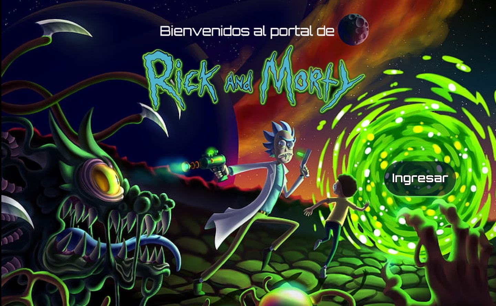

# El Portal de Rick and Morty.

Rick an Morty es una serie de televisión estadounidense de animación para adultos creada por Justin Roiland y Dan Harmon en 2013 para Adult Swim. La serie sigue las desventuras de un científico, Rick, y su fácilmente influenciable nieto, Morty, quienes pasan el tiempo entre la vida doméstica y los viajes espaciales, temporales e intergalácticos.

El Portal de Rick and Morty es una página para fanáticos de la serie que deseen ver las características de sus personajes favoritos. 

## Investigación y diseño.

Nuestra página está orientada a fanáticos de la serie que quieran buscar acerca de sus personajes favoritos, permitiéndoles visualizarlos de manera ordenada y filtrarlos según género, especie, status, lugar de origen o locación. También pueden encontrar una barra de búsqueda para localizar de manera más rápida a su personaje.

## Prototipos en papel.

  

## Prototipo de baja fidelidad.
 

## Prototipo de alta fidelidad.
Nuestro prototipo de alta fidelidad fue realizado en Figma.

